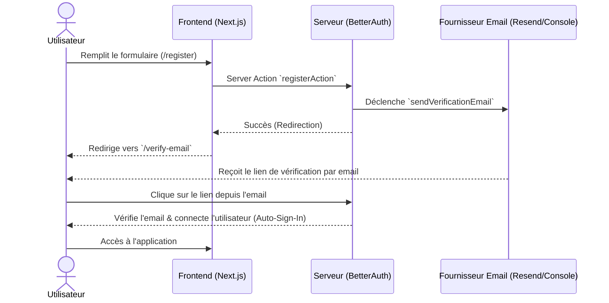
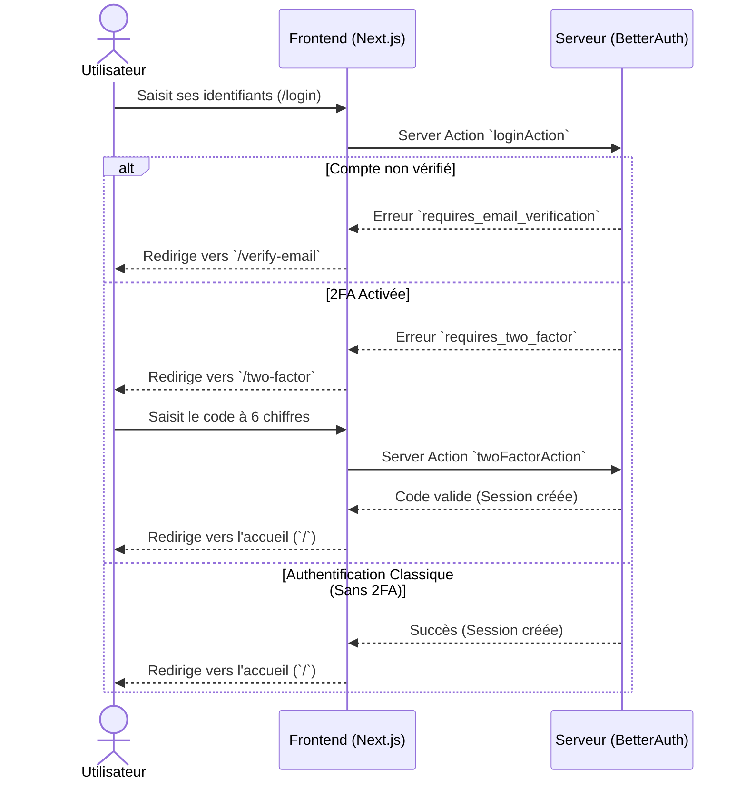
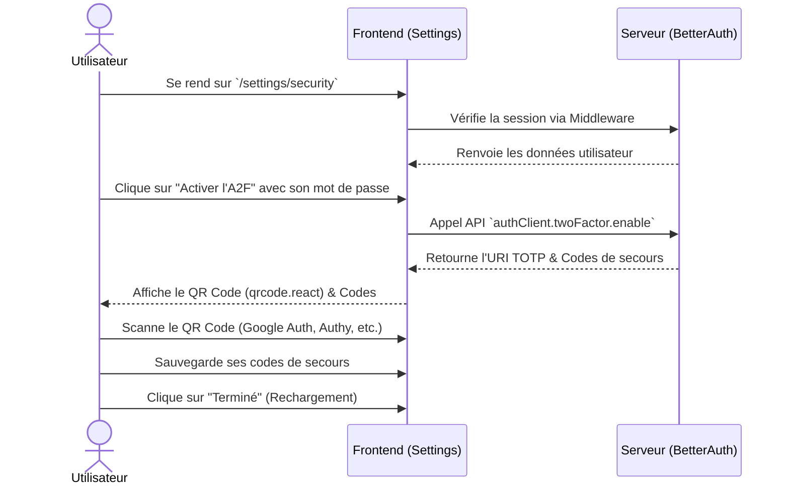
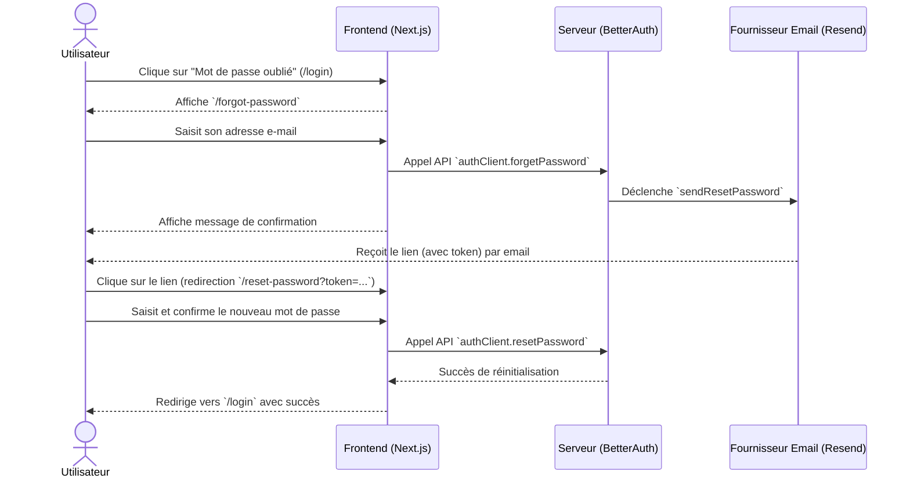

# Parcours Utilisateurs - Authentication & Sécurité (Recipedia)

Ce document illustre les différents parcours utilisateurs (workflows) implémentés dans l'application avec BetterAuth.

## 1. Inscription & Vérification d'E-mail

## 2. Connexion & Challenge 2FA

## 3. Configuration de l'Authentification à Deux Facteurs (2FA)

## 4. Oubli et Réinitialisation de Mot de Passe

